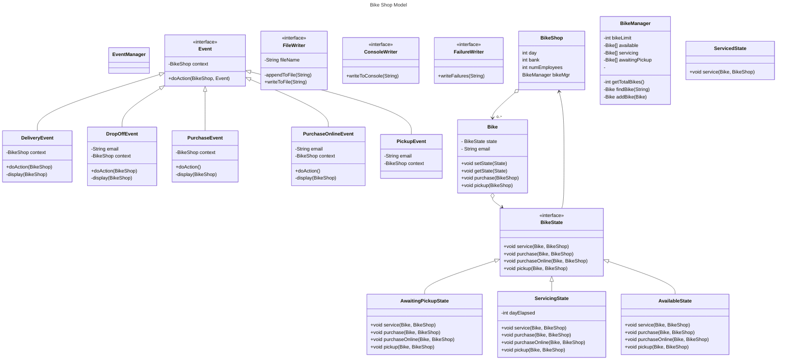

# OOSE Assignment2: Bicycle Shop Simulator
PurchasedState

By: Yoseph Campbell
Student Id: 21552155

# Project Description

## Sim input

- `BikeShopInput` class will give us the input.
- `nextMessage() returns a string or null. call `nextMessage()`
repeatedly until it returns null. -> use a while loop
- **Validate** the messages as some of them could be invalid
- Valid Messages are as following (all beginning in)
    - `DROP-OFF` (email address)
    - `PURCHASE-ONLINE` (email address)
    - `PICK-UP` (email address)
    - `DELIVERY`
    - `PURCHASE-IN-STORE`

## Sim logic

- 1 second = 1 day
- bike shop begins
    - $15k
    - 50 bikes
    - Can store 100 bikes
- all bikes are physically the same
    - at any given point in time some will be serviced
    - some will be awaiting pickup
    - those that are being serviced or awaiting pickup will not
    be able to be purchased but still count to the 100-bike limit
- bike has 1 employee who gets paid $1k every 7 seconds
- bike shops bank can become negative

### Messages

- `DELIVERY`
    - 10 bikes delivered to bike shop only if it has space for
    10 bikes. (<= 90) & atleast $10k cash
    - otherwise reject delivery
- `DROP-OFF` (email-addy)
    - bike is brought to store to be serviced
    - accepted if atleast space for 1 bike
    - 2 seconds until servicing is done
    - hold on until it is picked-up
- `PURCHASE-ONLINE` (email addy)
    - bike wants to be purchased
    - need to have atleast 1 bike in shop available for purchase
        - bike needs to be not "reserved" already and not picked-up
        - bike is being serviced
    - bike is purchased for $1k
    - bikeshop reserves bike until pick-up
- `PURCHASE-IN-STORE`
    - bike is sold for $1k if any available bikes
- `PICK-UP` (email addy)
    - takes bike away if serviced (2 seconds elapsed) --> $100 is paid
    - purchased online
    - email addy must match `DROP-OFF` email addy

NOTE!

- Bikes purchased online or dropped-off for service
- several may share the same email address (one owner may have
multiple bikes)
- each message may result in failure under certain condition
- simulation must keep going regardless any error when parsing
a message must be treated likewise

**ASK**
> - Does the above imply that if a single owner picks up multiple
> bike at the same time, this means that we should do it in a 
> single transaction?

## Outputs

- Each second, must display the bike shops statistics
    - Number of days elapsed
    - Total cash in bank
    - Number of bikes avaialable for purchase
    - Number of bikes being serviced
    - Number of bikes awaiting pick-up
- Any **attempt** at delivery, drop-off, purchase (online or
in-store), pickup. the message must be shown on screen
- In the event of failure, on screen message must be accompanied
by the word "FAILURE" followed by the cause:
    - Not enough space (to store more bikes)
    - Not enough cash (for store to purchase bikes)
    - No bikes left (for customer to purchase)
    - No bike, matching customer (for pick-up)
    - Bike not ready (still in service)
    - Invalid Message (Parsing error)
- All of the above must be written to an output file called
"sim_results.txt".
    - Messages are in real-time
- At end of simulation (after user presses enter) program must
display overall simulation statistics including:
    - Total number of input messages
    - total number of failures
    
# Requirements

## General Code Quality (6 marks)

- well commented
- suppress specific PMD warnings if it is reasonable

## Clear & Distinct Package/Class/Interface/Method responsibilities

- Break up application into multiple namespaces in some meaningful way
- You are not specifically required to use MVC, but can take
inspiration to divide responsibilities

## Appropriate Error Handling and Logging

- Use exception handling appropriately
- Program must include a reasonabl set of logging statements

## Implementation of a factory (or factories)

- Do not need to dependency inject instances of state subclasses
when using the State Pattern
- Factories are able to create their own new objects
- Avoid use of singletons

## Appropriate Use of the Observer Pattern

- Find a meaningful, practical user of this pattern in design of
the program
- Must use actual polymorphism

## Appropriate Use of the State Pattern

- Practical use of the state pattern as part of your design

## Clear and Correct UML diagrams

- Use class diagram to show the structure of the entire app
- Use State charts showing states and state transitions
corresponding to State Pattern implementation

## Bonus marks

- Up to 4 bonus marks for appropriate use of generics
    - You need atleast one class/interface with a generic type
    param which takes on atleast two different types
    - It must contribute to type-safe code reuse &
    - it must help address the actual problem statement

NOTE: Assessment mark is still capped at 100%

# Criteria

## UML design

### Class Descriptions and requirements

#### BikeShop

BikeShop begins with:

- bank =15000
- 50 bikes all available for purchase
- hold a maximum of 100 bikes in total

---

- Bikeshop handles services related to Bikeshop function
    - Delivery
        - Accepts 10 bikes available for purchase
            1. if it has space for the bikes
            2. has at least 10000 in bank
            3. 5000 is deducted from the bank
        - Reject otherwise
    - Drop off (servicing)
        - Accepts 1 bike to service (not available for purchase)
            1. if it has space for 1 bike
            2. no cash is exchanged
            3. servicing the bike takes 2 days
            4. holds the bike to await for pickup
    - Pickup
        - Pickup bike either being serviced or purchased online
            1. if the bike email associated with service bike 
                1. check if it is awaiting pickup
                2. if it is not available for pickup then nothing happens
                3. If it is available for pikcup remove bike from shop
                4. Add 100 to bank
            2. If the bike email associated with an online purchase
                1. remove the bike
    - Purchase in store
        - Purchases 1 bike
            - that is available for purchase
            - remove the bike from inventory
            - add 1000 to bikeshop bank
        - If no available bikes for purchase nothing happens
    - Purchase Online
        - Purchases 1 bike
            - that is available for purchase
            - set the bike state to awaiting pickup
            - add 1000 to bikeshop bank
        - if no available bikes for purchase nothing happens

### BikeManager & Bikes

- Each bike can have a possible set of states:
    - Available for purchase
    - Currently servicing
    - Finished servicing
    - Awaiting pickup

- A bike that is being serviced cost 100
- A bike that is fresh and available to be picked up is 1000

---

#### BikeManager and Bike class

